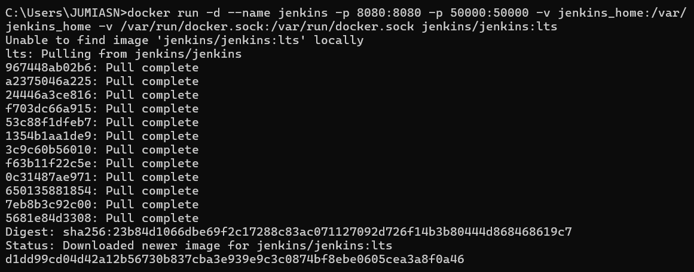
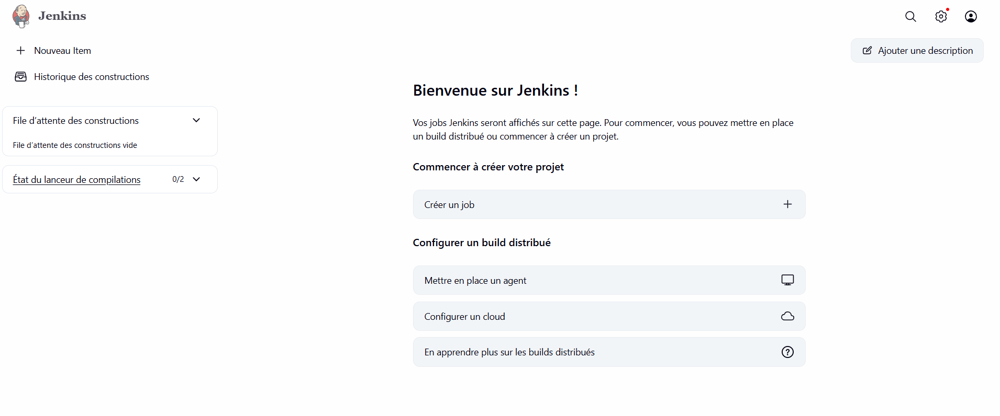
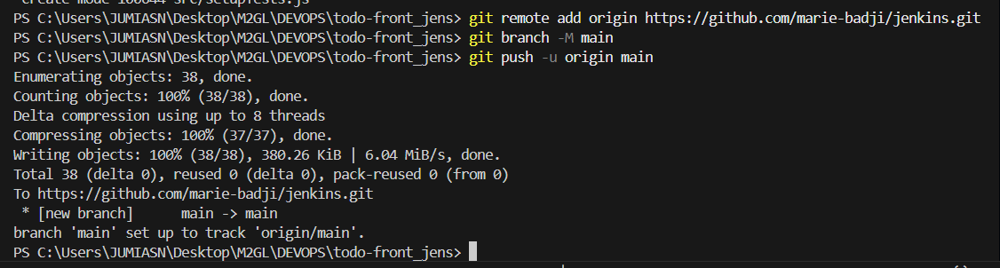
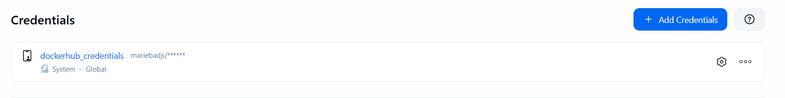
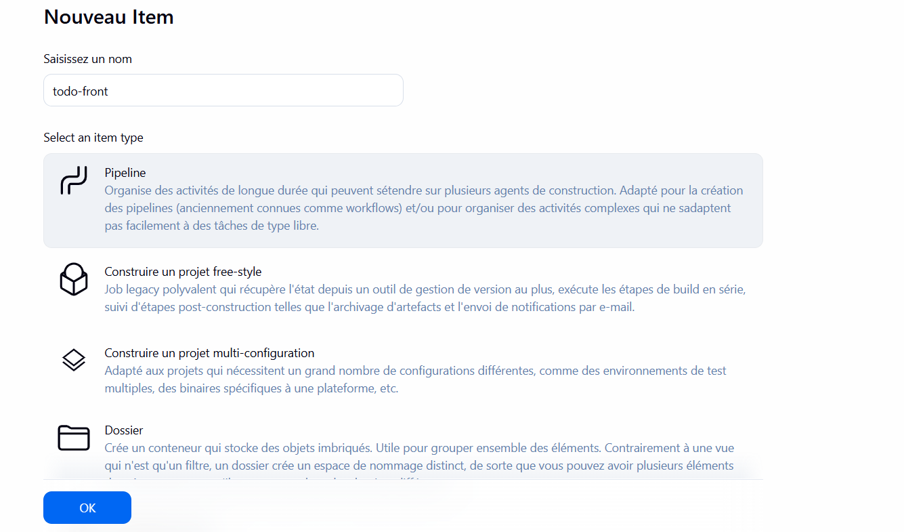
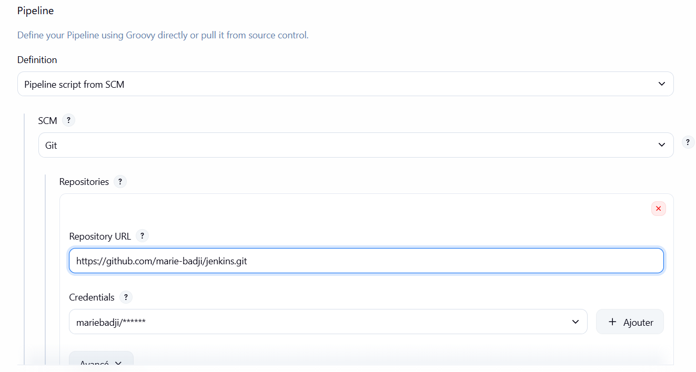
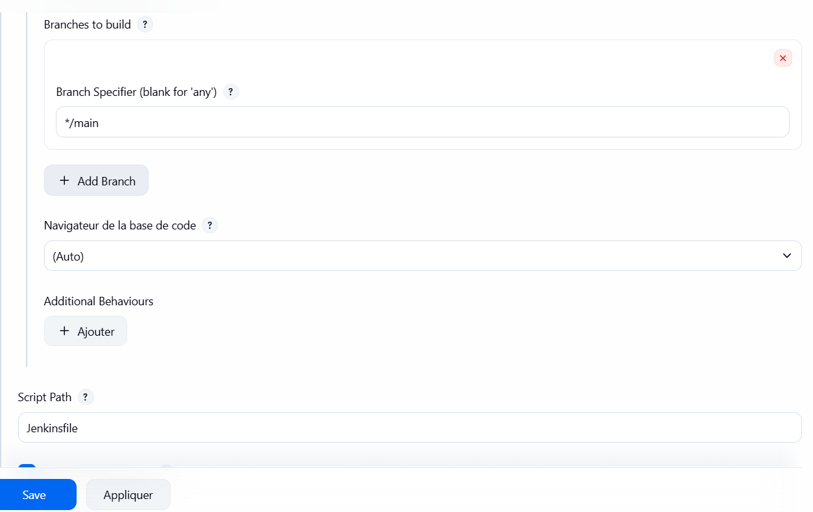
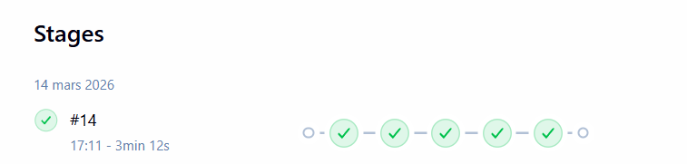
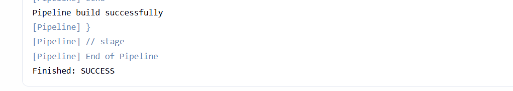
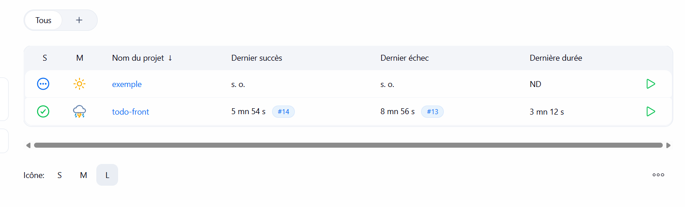

# todo-front — Pipeline CI/CD avec Jenkins

> Application React de gestion de tâches déployée via une pipeline CI/CD complète avec Jenkins et Docker.

---

## Sommaire

- [Présentation du projet](#présentation-du-projet)
- [Technologies utilisées](#technologies-utilisées)
- [Structure du projet](#structure-du-projet)
- [Étapes de mise en place](#étapes-de-mise-en-place)
- [Pipeline CI/CD](#pipeline-cicd)
- [Différence avec GitLab CI et GitHub Actions](#différence-avec-gitlab-ci-et-github-actions)
- [Lancer le projet en local](#lancer-le-projet-en-local)
- [Auteur](#auteur)

---

## Présentation du projet

Ce projet est une application **React** de gestion de tâches (Todo App). Il a été conçu dans le cadre d'un TP DevOps pour mettre en place une **pipeline CI/CD complète** avec **Jenkins**.

Jenkins est installé via Docker et orchestre automatiquement le build, les tests et le push de l'image Docker sur Docker Hub à chaque push sur GitHub.

---

## Technologies utilisées

| Technologie | Rôle |
|-------------|------|
| **React** | Framework front-end |
| **npm** | Gestionnaire de paquets |
| **Jenkins** | Serveur CI/CD auto-hébergé |
| **Docker** | Conteneurisation de Jenkins et de l'application |
| **Docker Hub** | Registry pour stocker l'image Docker |
| **Nginx** | Serveur web pour servir l'application en production |
| **GitHub** | Hébergement du code source |

---

## Structure du projet

```
todo-front/
├── .github/
├── Jenkinsfile          # Configuration de la pipeline Jenkins
├── Dockerfile           # Image Docker multi-stage (build + serve)
├── .dockerignore        # Fichiers exclus du build Docker
├── nginx.conf           # Configuration du serveur Nginx
├── public/              # Fichiers statiques publics
├── src/                 # Code source React
│   ├── App.js
│   ├── App.test.js
│   └── index.js
├── package.json         # Dépendances npm
└── README.md            # Documentation du projet
```

---

## Étapes de mise en place

### Étape 1 — Installer Jenkins avec Docker

Jenkins est lancé dans un conteneur Docker avec accès au socket Docker de la machine hôte.

```bash
docker run -d --name jenkins \
  -p 8080:8080 \
  -p 50000:50000 \
  -v jenkins_home:/var/jenkins_home \
  -v /var/run/docker.sock:/var/run/docker.sock \
  jenkins/jenkins:lts
```



---

### Étape 2 — Accéder à Jenkins

Une fois Jenkins démarré, l'interface est accessible sur `http://localhost:8080`.



---

### Étape 3 — Pusher le projet sur GitHub

Initialisation du repo Git et push du projet avec le `Jenkinsfile` à la racine.

```bash
git remote add origin https://github.com/marie-badji/jenkins.git
git branch -M main
git push -u origin main
```



---

## Pipeline CI/CD

La pipeline est définie dans le `Jenkinsfile` et se compose de **4 stages**.

```
push → [Build React] → [Unit Test] → [Push Docker Hub] → [Deploy]
```

### Stage 1 — Build React
- Utilise l'image Docker `node:18-alpine`
- Installe les dépendances avec `npm install`
- Compile l'application avec `npm run build`
- Sauvegarde les fichiers dans `staging/`

### Stage 2 — Unit Test
- Utilise l'image Docker `node:18-alpine`
- Exécute les tests avec `npm test`
- Résultat : `1 passed, 1 total`

### Stage 3 — Push to Docker Hub
- Utilise l'image Docker `docker:25.0.3`
- Se connecte à Docker Hub via `dockerhub_credentials`
- Build l'image : `mariebadji/todo-front:vN` *(N = numéro de build)*
- Push l'image sur Docker Hub

### Stage 4 — Deploy (simulé)
- Affiche un message de confirmation
- Le déploiement réel nécessite un serveur distant avec SSH

### Fichier `Jenkinsfile`

```groovy
pipeline {
    agent none

    stages {
        stage('Build React') {
            agent {
                docker {
                    image 'node:18-alpine'
                    args '-u root'
                }
            }
            steps {
                sh "npm install --force"
                sh "npm run build"
                sh "mkdir -p staging && cp -r build/* staging/"
            }
        }

        stage('Unit Test') {
            agent {
                docker {
                    image 'node:18-alpine'
                    args '-u root'
                }
            }
            steps {
                sh "npm install --force"
                sh "npm test -- --watchAll=false --passWithNoTests"
            }
        }

        stage('Push to Docker Hub') {
            agent {
                docker {
                    image 'docker:25.0.3'
                    args '-u root -v /var/run/docker.sock:/var/run/docker.sock'
                }
            }
            steps {
                withCredentials([usernamePassword(
                    credentialsId: 'dockerhub_credentials',
                    passwordVariable: 'DOCKER_HUB_PASSWORD',
                    usernameVariable: 'DOCKER_HUB_USERNAME'
                )]) {
                    sh "docker login -u ${DOCKER_HUB_USERNAME} -p ${DOCKER_HUB_PASSWORD}"
                    sh "docker build -t ${DOCKER_HUB_USERNAME}/todo-front:v${BUILD_NUMBER} ."
                    sh "docker push ${DOCKER_HUB_USERNAME}/todo-front:v${BUILD_NUMBER}"
                }
            }
        }

        stage('Deploy') {
            agent any
            steps {
                withCredentials([usernamePassword(
                    credentialsId: 'dockerhub_credentials',
                    passwordVariable: 'DOCKER_HUB_PASSWORD',
                    usernameVariable: 'DOCKER_HUB_USERNAME'
                )]) {
                    echo "Image ${DOCKER_HUB_USERNAME}/todo-front:v${BUILD_NUMBER} pushee sur Docker Hub !"
                    echo "Pipeline termine avec succes !"
                }
            }
        }
    }

    post {
        success {
            echo "Pipeline build successfully"
        }
        failure {
            echo "Pipeline failed"
        }
    }
}
```

---

## Dockerfile

Image **multi-stage** pour une image finale légère :

```dockerfile
# Stage 1 : Build
FROM node:18-alpine AS build
WORKDIR /app
COPY package*.json ./
RUN npm install --force
COPY . .
RUN npm run build

# Stage 2 : Serve avec Nginx
FROM nginx:stable-alpine
COPY --from=build /app/build /usr/share/nginx/html
COPY nginx.conf /etc/nginx/conf.d/default.conf
EXPOSE 80
CMD ["nginx", "-g", "daemon off;"]
```

### Configurer les credentials Docker Hub

Dans **Manage Jenkins → Credentials → Global → Add Credentials** :

- **Kind** : `Username with password`
- **Username** : `mariebadji`
- **Password** : token Docker Hub
- **ID** : `dockerhub_credentials`



---

### Créer le pipeline Jenkins

Dans **Nouveau Item** → nommer le projet `todo-front` → sélectionner **Pipeline**.



---

### Configurer le pipeline (Pipeline script from SCM)

Lier le pipeline au repo GitHub avec les paramètres suivants :

- **Definition** : `Pipeline script from SCM`
- **SCM** : `Git`
- **Repository URL** : `https://github.com/marie-badji/jenkins.git`
- **Credentials** : `mariebadji/******`



- **Branch** : `*/main`
- **Script Path** : `Jenkinsfile`



---

### Pipeline exécutée avec succès

Tous les stages passent au vert en **3 minutes 12 secondes**.



---

### Résultat final

Le pipeline termine avec le statut **SUCCESS**.





---


## Lancer le projet en local

```bash
# Cloner le projet
git clone https://github.com/marie-badji/jenkins.git
cd jenkins

# Installer les dépendances
npm install

# Lancer en mode développement
npm start
```

### Avec Docker

```bash
docker build -t todo-front 
docker run -p 80:80 todo-front
```

### Relancer Jenkins

```bash
docker start jenkins
```

Accessible sur `http://localhost:8080`.

---

## Auteur

**Marie BADJI** — M2GL DevOps  
Dépôt GitHub : [github.com/marie-badji/jenkins](https://github.com/marie-badji/jenkins)